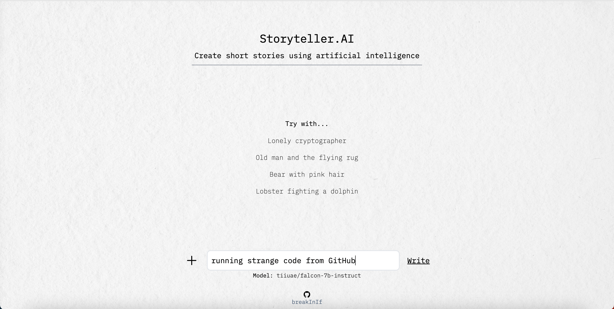
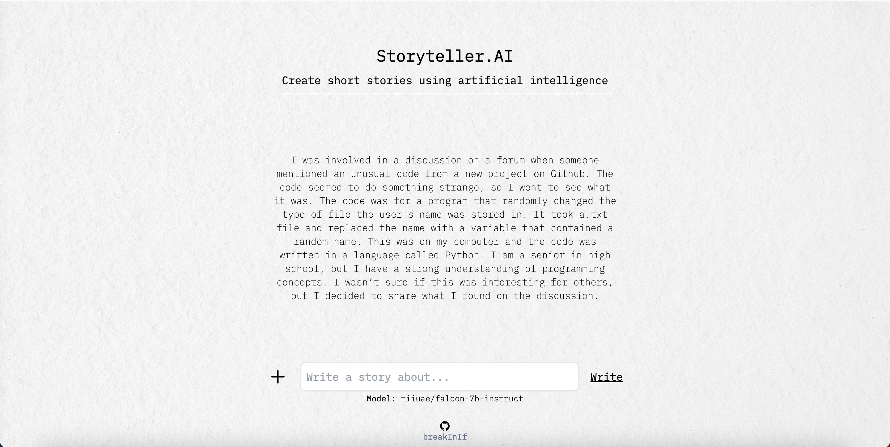

# Storyteller.AI
Create short stories using artificial intelligence.

This project uses models from HuggingFace Hub and LangChain to write short stories.

## Getting started

Install the project by cloning this repository

```bash
git clone https://github.com/breakInIf/storyteller.ai.git
cd storyteller.ai
```

For everything to work properly you need to start the server and the interface

### Server

Start by going to the `server` folder and installing dependencies

```bash
cd ./server
pip install -r requirements.txt
```

then you need to add your HuggingFace API key to environment variable

```bash
export HUGGINGFACE_KEY=<YOUR_API_KEY>
```

and finally start the server by running

```bash
uvicorn main:app
```

### Interface

Start by going to the `interface-story` folder and installing dependencies

```bash
cd ./interface-story
npm install
```

and start the interface by running

```bash
npm run dev
```

## Usage

1. Navigate to [http://localhost:3000](http://localhost:3000) (can take more time the first time)

2. Introduce about what you want to write your story



3. Click  **Write** button



Well... maybe your story will be more fascinating

4. Done!
